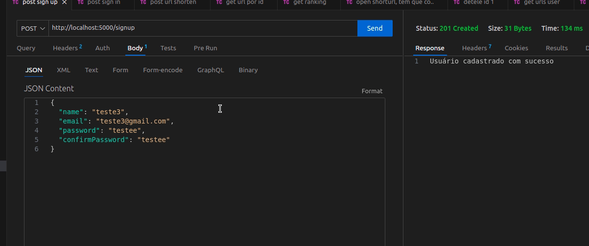

## Shortly
Bem-vindo ao Shortly! Esta é uma API de encurtamento de URLs que permite transformar URLs longas em URLs curtas e fáceis de compartilhar. Com o Shortly, você pode simplificar suas URLs longas e acompanhar o número de cliques em cada URL encurtada.

  

***Instalação***

Para executar este projeto localmente, siga estas etapas:

**1** Clone este repositório em sua máquina local.

git clone https://github.com/luizarn/shortly.git

**2** Acesse o diretório do projeto.

cd shortly

**3** Instale as dependências necessárias.

npm install

**4** Inicie o projeto.

npm start

***Funcionalidades***

Aqui estão algumas das principais funcionalidades oferecidas por este projeto:

* Encurtamento de URLs: Os usuários podem inserir uma URL longa e obter uma versão encurtada para compartilhar.
* Acompanhamento de cliques: Os usuários podem acompanhar o número de cliques em cada URL encurtada, obtendo insights sobre o uso das URLs compartilhadas.
